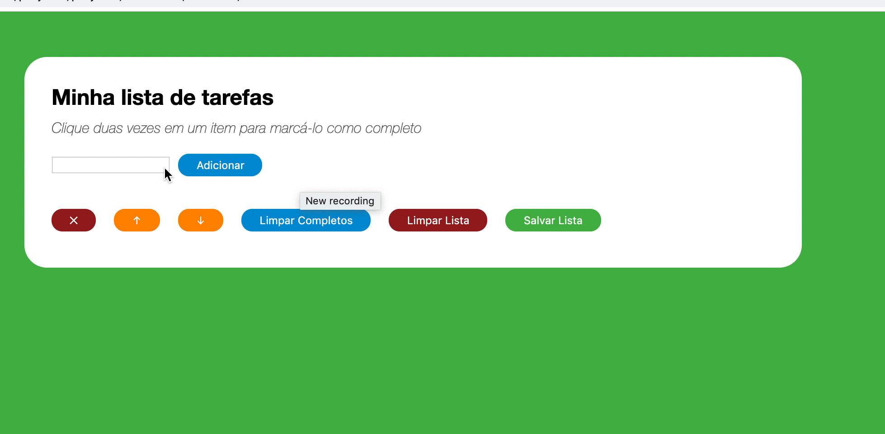
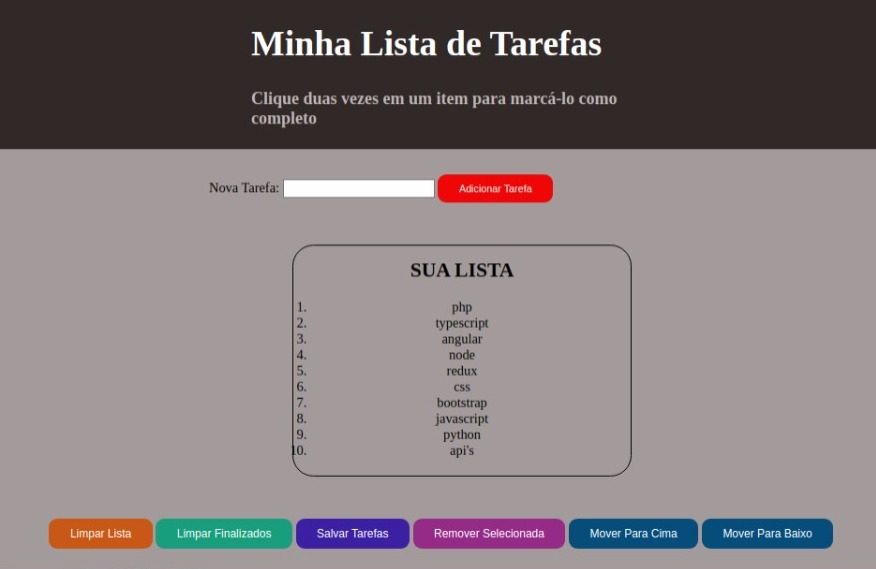

# Projeto Lista de Tarefas!

Bem vindos(as) ao meu repositorio do projetinho desenvolvido junto as aulas da Trybe. Nesse projeto foi testado a capacidade dos alunos de manipular o `HTML`, `CSS` e `JavaScript`.
O objetivo é o desenvolvimento de uma pagina que permite criar uma lista de tarefa (To Do List) permitindo adicionar tarefas a ser executadas e dar check e remover tarefas já feitas. Como a demonstraçao abaixo:

Aqui voce pode observar o resultado pela demonstraçao abaixo:

